

# ShopFlow — Full-Stack E-Commerce App

### *Your business is losing mobile customers every day without an app. ShopFlow fixes that.*

---

## 💡 The Problem

> A clothing brand in the UK gets 500 Instagram DMs a month.
> They reply manually. They take orders on WhatsApp.
> They lose track of stock, miss orders, and have zero mobile presence.

> A restaurant in Canada has 200 loyal customers.
> But no app. No loyalty system. No way to push offers.
> Their competitor launched an app — and took their customers.

**70% of e-commerce traffic is now mobile. If your business has no app — you are invisible.**

ShopFlow is the complete answer. A production-ready, dual-sided Flutter e-commerce system — a powerful **Admin Panel** to run your store, and a beautiful **Customer App** to sell through.

---

## ✅ What ShopFlow Delivers

| Business Problem | ShopFlow Result |
|-----------------|-----------------|
| Taking orders via WhatsApp and DMs | Customers order directly from the app — zero manual work |
| No way to manage products digitally | Full product management — add, edit, delete in seconds |
| Stock runs out without warning | Real-time inventory tracking — always know what's available |
| No visibility of orders and revenue | Admin dashboard — all orders, revenue, and stats live |
| Customers forget about the store | Push notifications — send offers to all customers instantly |
| No customer accounts or history | User profiles with full order history and tracking |
| Manual order processing | One-tap order management — confirm, process, complete |
| Customers can't search for products | Smart search + category filtering — find anything fast |

---

## 📱 Two Complete Apps — One Codebase

ShopFlow is a **dual-sided system** — a fully featured Admin Panel AND a complete Customer App, both synced in real-time via Firebase.

---

## 🛠️ Admin Panel

Everything a business owner needs to run their store:

- 📊 **Dashboard** — total orders, revenue, new customers, pending orders — all live
- 📦 **Product Management** — add products with images, price, stock, category, description
- 🗂️ **Category Management** — organize products into clean browsable categories
- 📋 **Order Management** — view all orders, update status: Pending → Processing → Delivered
- 👥 **Customer Management** — full customer list with profiles and order history
- 🔔 **Push Notifications** — broadcast offers and updates to all customers in one tap
- 📈 **Analytics** — daily, weekly, monthly sales and order trends

---

## 🛍️ Customer App

Everything a shopper needs for a seamless buying experience:

- 🔐 **Smart Auth** — register/login via Email or Google (Firebase Auth)
- 🏠 **Home Feed** — featured products, new arrivals, trending items
- 🔍 **Search & Filter** — search by name, filter by category, sort by price
- 🛒 **Cart & Checkout** — add items, review cart, place order in 3 taps
- ❤️ **Wishlist** — save favorite products for later
- 📦 **Order Tracking** — live status updates from order placed to delivered
- 👤 **User Profile** — manage personal info, addresses, and order history
- 🔔 **Push Notifications** — instant alerts for order updates and store offers

---

## 🛠️ Tech Stack

| Layer | Technology |
|-------|-----------|
| Framework | Flutter + Dart|
| State Management | Riverpod |
| Navigation | GoRouter |
| Authentication | Firebase Auth |
| Database | Firebase Firestore |
| File Storage | Firebase Storage |
| Push Notifications | Firebase Cloud Messaging (FCM) |

---

---

## 📸 Screenshots

### 🛠️ Admin Panel

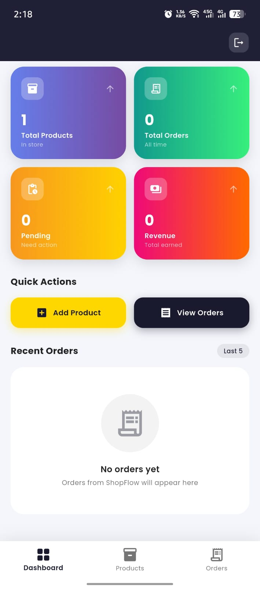
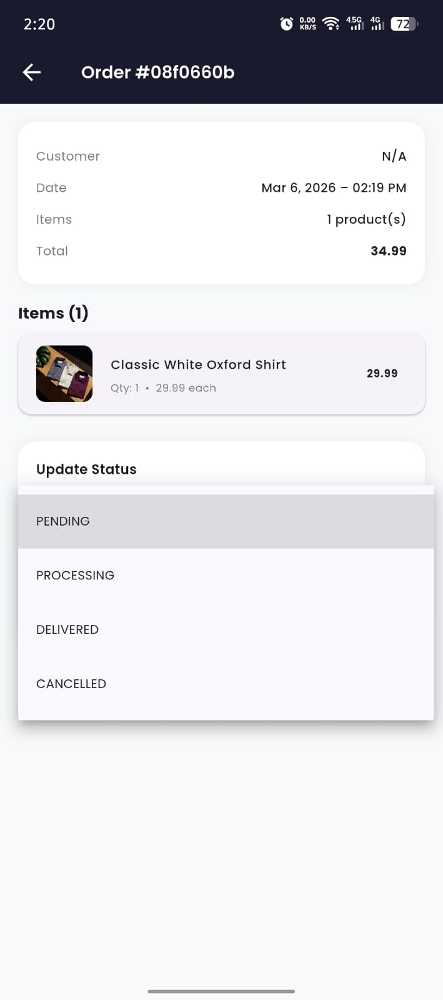
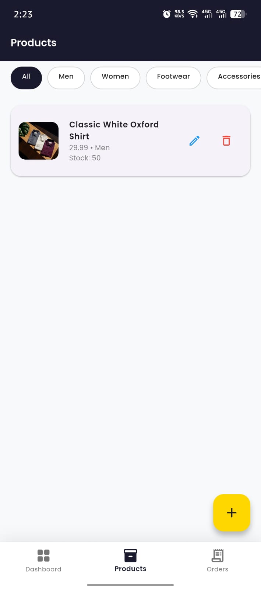
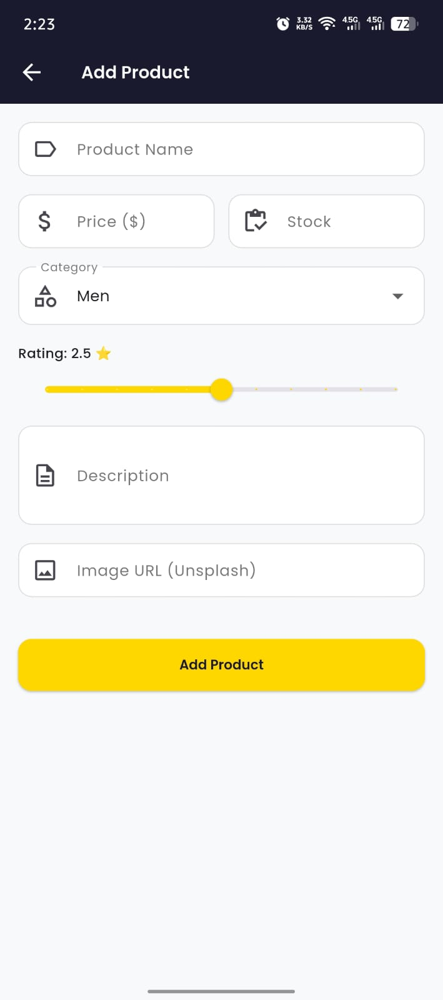

### 🛍️ Customer App

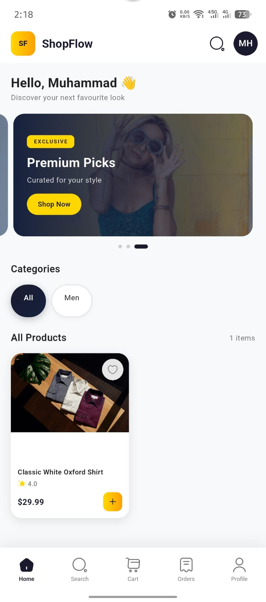
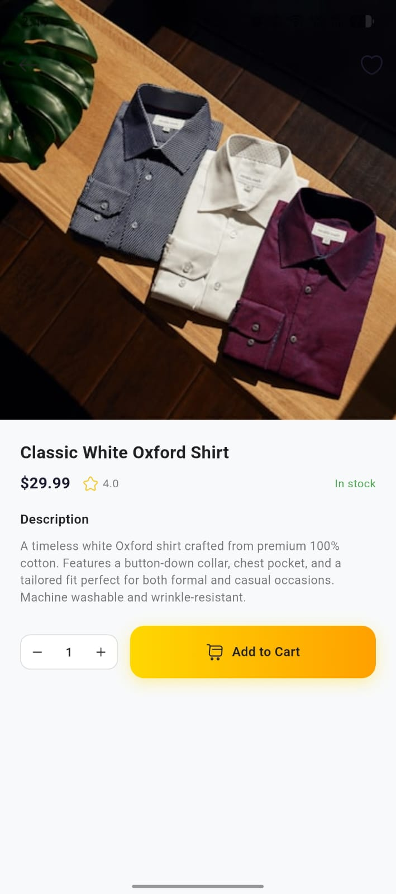
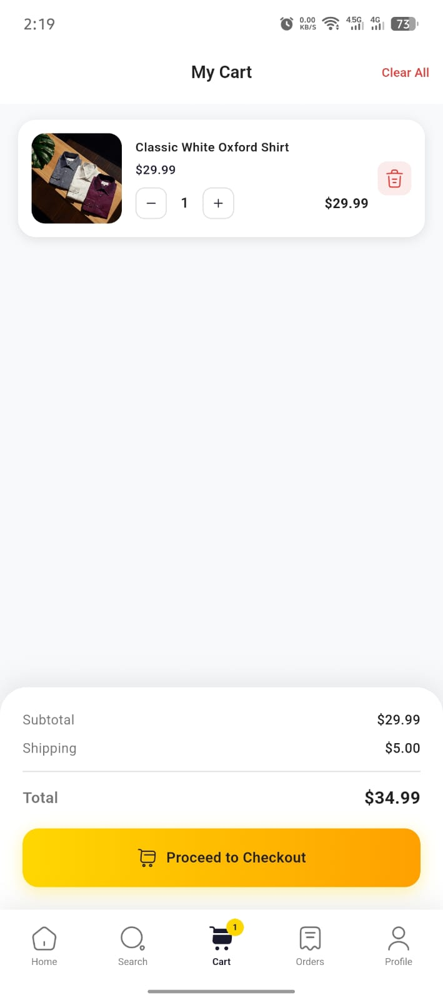
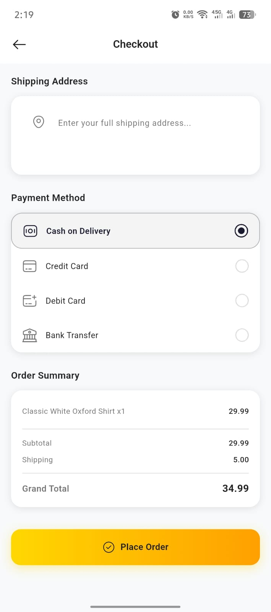
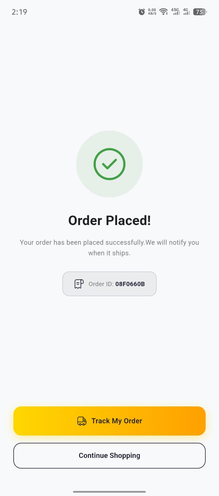
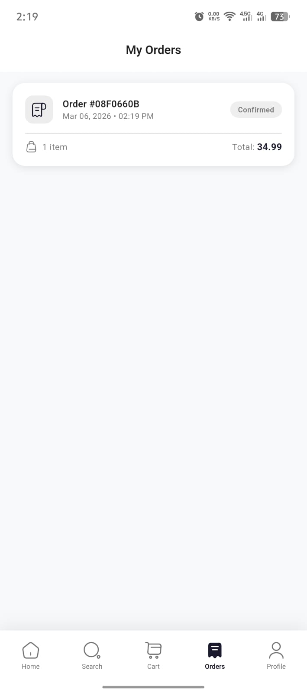
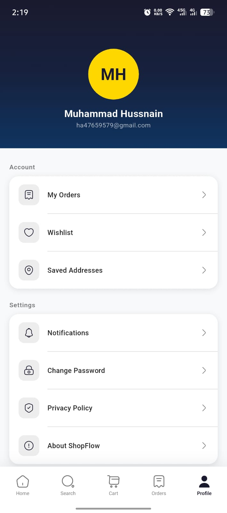

---

---

## 💼 Need an E-Commerce App for Your Business?

This is a **real, production-ready system** — not a tutorial project.

If you need a shopping app, marketplace, or any Flutter + Firebase solution built for your business:

**Muhammad Hussnain** — Flutter Developer, Pakistan
📧 muhammadhussnain0193@gmail.com
🔗 [github.com/MuhammadHussnain07](https://github.com/MuhammadHussnain07)

> I deliver clean, scalable, production-ready Flutter apps — fast.
> Specialized in: Flutter · Firebase · E-Commerce · REST APIs · n8n Automation

---

⭐ **Star this repo** if it helped you — it helps other developers discover it!

*Built with ❤️ using Flutter & Firebase*

